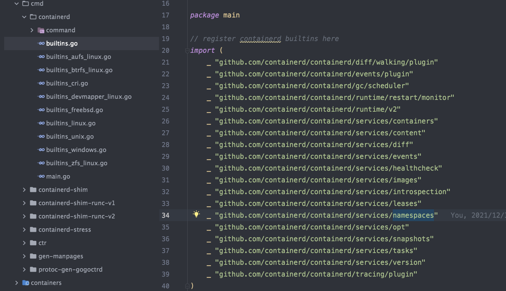

## Plugin的结构体
和Plugin相关的主要数据结构有三个,**Plugin**, **Registration**，**InitContext**. 
- *InitContext*: 主要是用于插件的初始化.
- *Plugin*: 主要是使用`init context`实现的一个Plugin.
- *Registration*  包含注册Plugin的信息.

与之有关的还是一个*set*数据结构,  它是一个有序的初始化插件集合.

#### InitContext

**InitContext** 是对于go原始context的扩展,  作为每个插件的Init函数的参数, *init*函数主要同过这个信息来验证自己依赖的Plugin是否已经注册.

```go

// InitContext is used for plugin initialization
type InitContext struct {
	Context      context.Context
	Root         string
	State        string
	Config       interface{}
	Address      string
	TTRPCAddress string

	// deprecated: will be removed in 2.0, use plugin.EventType
	Events *exchange.Exchange

	Meta *Meta // plugins can fill in metadata at init.

	plugins *Set
}
```

#### Plugin

*Plugin* 结构体就是实际的插件,如Namespace, container, task. 结构体如下:

```go
// Plugin represents an initialized plugin, used with an init context.
type Plugin struct {
	Registration *Registration // registration, as initialized
	Config       interface{}   // config, as initialized
	Meta         *Meta

	instance interface{}
	err      error // will be set if there was an error initializing the plugin
}
```

如上, *instance* 保存的是每个具体的插件, 它是一个*interface{}* 类型,可以接收任何结构体.

#### Registration

*Registration* 是包含每个插件的注册信息, 如插件的类型, 是否禁用插件,插件的初始化函数.

```go
// Registration contains information for registering a plugin
type Registration struct {
	// Type of the plugin
	Type Type
	// ID of the plugin
	ID string
	// Config specific to the plugin
	Config interface{}
	// Requires is a list of plugins that the registered plugin requires to be available
	Requires []Type

	// InitFn is called when initializing a plugin. The registration and
	// context are passed in. The init function may modify the registration to
	// add exports, capabilities and platform support declarations.
	InitFn func(*InitContext) (interface{}, error)
	// Disable the plugin from loading
	Disable bool
}
```

*InitFn* 是一个函数, 它在 *InitContext* 之后调用, 随之实例化除一个插件.

##  插件初始化
之前说过*containerd*的大多数组件都是以Plugin的方式注册到系统中, 也就是说在containerd启动之前我们需要把所必要的插件都要实例化好, 这是怎么做的呢？

主要是使用 *go* 的 *init* 函数, 在每个包导入的时候同过执行*init*函数来将插件注册到containerd项目中.


我们来看一下 Plugin 是如何注册到注册中心的, 也就*init*函数:

```go
func init() {
	plugin.Register(&plugin.Registration{
		Type: plugin.GRPCPlugin,
		ID:   "namespaces",
		Requires: []plugin.Type{
			plugin.ServicePlugin,
		},
		InitFn: func(ic *plugin.InitContext) (interface{}, error) {
			plugins, err := ic.GetByType(plugin.ServicePlugin)
			if err != nil {
				return nil, err
			}
			p, ok := plugins[services.NamespacesService]
			if !ok {
				return nil, errors.New("namespaces service not found")
			}
			i, err := p.Instance()
			if err != nil {
				return nil, err
			}
			return &service{local: i.(api.NamespacesClient)}, nil
		},
	})
}
```

通过这种 *Init* 的方式会将所有启用的插件放到注册中心, 之后在创建 containerd 服务时会遍历注册中心的所有插件, 在这个过程中主要是: **实例化InitContext**,  **调用Init函数**.

以上，初始化的代码如下:
[https://github.com/containerd/containerd/blob/main/services/server/server.go#L224](https://github.com/containerd/containerd/blob/main/services/server/server.go#L224)

虽然containerd有大量的插件, 但对于内部的资源的管理主要包括两个Plugin, **Service Plugin** 和 **GRPC Plugin**. 我会以 `namespace` 资源进行介绍. 

#### Service and GRPC Plugin

Service Plugin是实现Namespace资源对应的GPRC服务组件, 对于Namespace, 其定义了五个GRPC调用接口,分别是**Get**, **Create**, **List**, **Update**, **Delete**.

实现以上接口的是 *service* 结构体,  而对于**GRPC Plugin**的每个函数其实没做什么,只是简单的调用一下**Service Plugin** 插件对应的函数,  因为**Service Plugin** 才是实际上做**Create**, **List**的接口. 

而对于 **GRPC Plugin** 本质上只是实现了GRPC的注册. 代码如下:

```go
func (s *service) Register(server *grpc.Server) error {
	api.RegisterNamespacesServer(server, s)
	return nil
}
```

> 注意: 在文件名上, 实现grpc功能的文件是service.go 而实现Service功能的是local.go.

在  Service Plugin  的 init 函数中要求先注册*Metadata Plugin* 和 *Event Plugin * . 

实现 namesapce 资源的  Service Plugin 是*local* 结构体.  它是一个包含boltdb和Publish 结构体.

```go
type local struct {
	db        *metadata.DB
	publisher events.Publisher
}
```

后面我们会介绍一下基于boltdb实现的Metadata数据结构. 