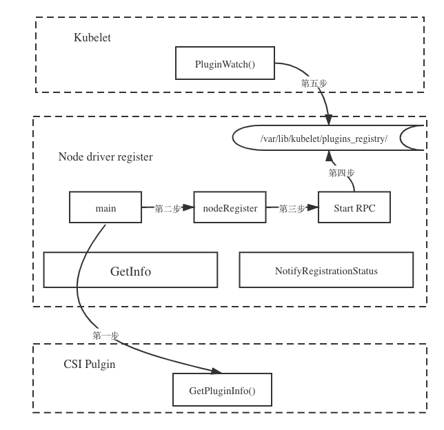

这篇文章是关于[node-driver-registrar](https://github.com/kubernetes-csi/node-driver-registrar)这个项目的源码剖析, 理解它能够更好的理解CSI的整个工作流程.


#### 介绍

**node-driver-registrar** 是一个为自定义插件提供向kubelet注册的sidecar容器; 同时也为kubelet执行mount/umount时操作来调用对应插件.

首先, 我们先了解一下有关的两个Socket.

- Registration socket:
  * 向 kubelet 注册驱动
  * 被 **node-driver-registrar** 创建
  * 在一个Node节点同过kubelet 插件路径下暴露一个hostpath. 也是一个sock文件, 这个路径必须挂载到`/registration`
  * 示例: `/var/lib/kubelet/plugins_registry/diskplugin.csi.alibabacloud.com-reg.sock`

- CSI driver socket:

  * 用于 kubelet 和 csi-driver 交互

  * 被 csi-driver创建
  * 通过 Kubelet 以外的其他地方的主机路径暴露在 Kubernetes 节点上。
  * 这事一个被 `--csi-address` 和 `--kubelet-registration-path` 引用的路径
  * 示例: `/var/lib/kubelet/csi-plugins/diskplugin.csi.alibabacloud.com/csi.sock`

  

在启动 **node-driver-registrar** 时我们需要传递两个Unix socket 参数:

* `--csi-address` 
  * 这是一个被挂载到 node-driver-registrar 容器内部的一个路径, 它是一个socket文件.  node-driver-registrar 通过它和CSI Plugin通信。

* `--kubelet-registration-path`
  * 这是一个Node节点上的路径, kubelet将同过它发送CSI操作. 注意:  这不是 上述的 *Registration socket* 路径.


从后面的参数传递来看, 这两个参数都是 CSI Plugin 的 sock 通信地址, 也就是说, **node-driver-registrar** 是直接和我们的 **CSI Plugin** 通信的, kubelet 获取到 **CSI Plugin** 的 sock 地址后也直接和 CSI Plugin 通信.


#### 权限

**node-driver-registrar** 不直接和kubernetes api 交互，所以不需要RBAC权限。 但是, 他需要许多挂载的文件权限:

- 可以访问**CSI driver**的 socket 文件
- 可以访问**registration socket**的文件


#### 部署

建议以Demonset的方式做为sidecar何CSI Plugin（[alibaba-cloud-csi-driver](https://github.com/kubernetes-sigs/alibaba-cloud-csi-driver)）一起部署, 如果实现了多个CSI Pulgin 就需要部署多个Sidecar.

以下是示例:

```yaml
      containers:
      - args:
        - --v=5
        - --csi-address=/var/lib/kubelet/csi-plugins/diskplugin.csi.alibabacloud.com/csi.sock
        - --kubelet-registration-path=/var/lib/kubelet/csi-plugins/diskplugin.csi.alibabacloud.com/csi.sock
        image: registry-vpc.us-west-1.aliyuncs.com/acs/csi-node-driver-registrar:v1.2.0
        imagePullPolicy: Always
        name: disk-driver-registrar
        resources:
          requests:
            cpu: 10m
            memory: 16Mi
        terminationMessagePath: /dev/termination-log
        terminationMessagePolicy: File
        volumeMounts:
        - mountPath: /var/lib/kubelet
          name: kubelet-dir
        - mountPath: /registration
          name: registration-dir
       ....
      volumes:
      - hostPath:
          path: /var/lib/kubelet/plugins_registry
          type: DirectoryOrCreate
        name: registration-dir
      - hostPath:
          path: /var/lib/kubelet
          type: Directory
        name: kubelet-dir
   注: 阿里云是直接将kubelet整个目录挂载出来了, 安装官方的示例可以只用挂载var/lib/kubelet/csi-plugins 目录就可以. 不清楚是否还有别的地方需要整个目录.       
       
```


#### 源码分析

###### 1. main() 函数

main() 函数主要实现了三个功能:

- 用户传递参数校验, 如: `--csi-address` ``--kubelet-registration-path`` 
- 实例化GRPC连接器,同过CSI Plugin 暴露的csi 地址调用 `GetPluginInfo` 函数获取对应的driver名称.
-  调用 *nodeRegister* 函数完成 csi plugin 的注册.

具体的代码可参考如下链接:

[https://github.com/kubernetes-csi/node-driver-registrar/blob/release-1.2/cmd/csi-node-driver-registrar/main.go#L96](https://github.com/kubernetes-csi/node-driver-registrar/blob/release-1.2/cmd/csi-node-driver-registrar/main.go#L96)


###### 2. nodeRegister() 函数

- 调用 newRegistrationServer() 函数初始化 registrationServer 结构体；
- 创建出插件注册的sock地址, 并验证改地址是否合法. 如: 验证sock的权限和是否存在.
- 为sock文件分配700的权限
- 启动一个通过unix socket 通信的 GRPC Service, 这个 RPC 对外暴露两个接口: `GetInfo` 和 `NotifyRegistrationStatus`.

具体的代码可参考如下链接:

[https://github.com/kubernetes-csi/node-driver-registrar/blob/release-1.2/cmd/csi-node-driver-registrar/node_register.go#L31](https://github.com/kubernetes-csi/node-driver-registrar/blob/release-1.2/cmd/csi-node-driver-registrar/node_register.go#L31)


###### 3. registrationServer结构体和接口


**registrationServer 结构体**

```go
type registrationServer struct {
	driverName string
	endpoint   string
	version    []string
}
```

- `driverName` : CSI Plugin 插件的名字, 对应阿里云的Disk 插件就是**diskplugin.csi.alibabacloud.com**.
- `endpoint`: kubelet 和 CSI Plugin 通信的sock文件地址.


**GetInfo() 函数** 

kubelet 同过调动 **node-driver-registrar** 的 *Getinfo()* 函数来获取插件的名称以及 GRPC 暴露的 Sock 地址.

```go
// GetInfo is the RPC invoked by plugin watcher
func (e registrationServer) GetInfo(ctx context.Context, req *registerapi.InfoRequest) (*registerapi.PluginInfo, error) {
	klog.Infof("Received GetInfo call: %+v", req)
	return &registerapi.PluginInfo{
		Type:              registerapi.CSIPlugin,
		Name:              e.driverName,
		Endpoint:          e.endpoint,
		SupportedVersions: e.version,
	}, nil
}
```


**NotifyRegistrationStatus() 函数**

kubelet 通过调用 Node-Driver-Registrar 的 NotifyRegistrationStatus 接口，通知注册 csi plugin 成功。

```go
func (e registrationServer) NotifyRegistrationStatus(ctx context.Context, status *registerapi.RegistrationStatus) (*registerapi.RegistrationStatusResponse, error) {
	klog.Infof("Received NotifyRegistrationStatus call: %+v", status)
	if !status.PluginRegistered {
		klog.Errorf("Registration process failed with error: %+v, restarting registration container.", status.Error)
		os.Exit(1)
	}

	return &registerapi.RegistrationStatusResponse{}, nil
}
```


#### CSI 插件注册的流程

这里简单总结一下 CSI Plugin 插件注册的流程, 为后面的详细分析做一下铺垫.

###### 第一步

**node-driver-registrar** 启动后根据配置的 CSI Plugin 地址调用  *GetPluginInfo* 接口获取 driver 的名字.

###### 第二步

在目录 `/registration` 下创建一个以`{driver-name}`-reg.sock的文件,并通过它提供一个 GRPC 服务, 该服务提供两这个接口,分别是**GetInfo**, **NotifyRegistrationStatus**.

###### 第三步

kubelet 会有一个组件叫做**Plugin watch**, 这个组件会不停的监听 */var/lib/kubelet/plugins_registry/* 目录下文件的创建来完成后续 CSI 的注册.




