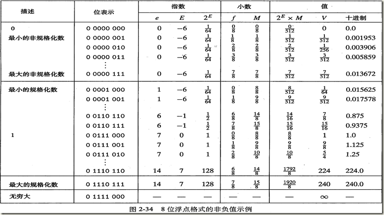

计算机基础之数字的表示

[TOC]

## 一、常用进制

对于习惯使用十个手指头的人类来说，早已习惯使用数字1~10来表示我们生活的数字。 我们也称之为十进制数。

但对于我们现在使用过计算机的人来说都知道计算机底层采用的都是二进制数来表示，这是由于依赖于底层电器信号的限制我们只能模拟出低电频和(0)和高电频(1)的信号,自然使用数字**0**和**1**表示最为合适. 但这种表示方法对于人来说不易读而且表示冗长;所以,向上又使用了十六进制来表示，使其变得易读。

#### 二进制

二进制，也就是由**0**和**1**组成,用来表示一个十进制**5**数如下:

```python
0000 0101
```

二进制数是可以计算的,也可以做逻辑运算,如我们计算一个十进制**5**加**3**:

```python
  0000 0101
+ 0000 0011    #逢二进一
= 0000 1000
```

当然还有我们常用的**与**、**或**、**非**、**异或**，表示分别如下:

**分别以十进制数5和3做计算 **

```python
  0101
& 0011
--------------
  0001
```

```python
  0101
| 0011
--------------
  0111
```

```python
~ 0101
--------------
  1010
```

```python
  0101
^ 0011
--------------
  0110
```

对于异或来说，可以简单的记住一个规则:**相同则为0，不同则为1**。

#### 十进制

这个掰一掰手指就知道了,就不多说了。

#### 十六进制

**十六进制** 在数学上是一种逢16进1的进位制。用数字0~9和字母A~F表示。

​																---------- 百度百科

十六进制的转换也很简单,介绍下二进制和十进制分别转换为16进制。

```python
  0011 1011 0111 1110
     3   B     7    E
```

```python
4877÷16=304....13(D)
304÷16=19....0
19÷16=1....3
1÷16=0....1
---------------
130D
```

在C语言中，以0x或者0X开头的数字常量被认为是十六进制的值。

## 二、数字编码

对于有10个手指的人类来说，使用十进制来表示一个数是很容易理解的事情。我们知道现在计算机普遍使用二进制来表示，这是因为二进制能够工作的更好。单独的讲某一个位没有太多的意义，可以将多个位组合起来，再加上某种解释，就可以用来表示我们日常生活中常用的数字。 在生活中数又分为**有符号**、**无符号**数和**浮点数**。

#### 无符号

无符号表示大于或者等于0的数字，是基于传统的二进制表示法编码。

对于一个十进制数来说,如果我们想表示`999`这个数，我们也可以写成`9*10^2+9*10^1+9*10^0`.对于用二进制来表示表示就更简单了,二进制的每一个位的取值只有两种情况**0**或者**1**. 对于一个8位的二进制**10110011**数表示如下:
$$
1*2^7+0*2^6+1*2^5+1*2^4+0*2^3+0*2^2+1*2^1+1*2^0   => \sum_{2}^{i}*{i}
$$
如上，该数字表示十进制数为**179**，对于**8**位的二进制数我们能够表示的范围为0(00000000)~255(11111111).

无符号的二进制数表示一个很重要的特性，也就是对于任何介于0~2^w-1 之间的数值都有一个唯一w为的值编码。

#### 有符号数

有符号表示可以为正或者为负的数字，通常采用**补码**进行编码。 负数是有符号的数值,对于负数来说，我们最难的就是如何表示它的负号.先来看看什么是**原码**、**补码**、**反码**。

**原码**

原码是计算机中数字的二进制定点表示法。数码序列中最高位表示符号位，符号0表示正数，符号1表示负数;其余位表示数值的大小。这样我们使用一个符号位的引用就可以表示正数、负数。对于一个8位二进制数来说，能够表示的范围就是-127(1111 1111)~127(0111 1111)。 但对于原码表示有一个致命的缺点，就是不能参加运算。例如：-1(1000 0001) + 1(0000 0001) = 0(1000 0010) 这个二进制数的实际数值是-2.这显然不对。

**反码**

如果一个数是正数，那么这个数的反码就是它本身。 负数的反码是在原码的基础上，符号位不变，数值位按位取反。这样对于上述-1+1等于-2的问题就解决了。0001 + 1110(-1的反码) = 1111(反码) 转换到对应的数为-0. 但这又带来了一个问题.即0这个数有两种表示法+0和-0。

**补码**

补码的表示也分为两种，正数的补码是其原码本身，负数的补码是在其反码基础上再加1。

例如：

【+7】补码 = 0000 0111

【-7】 补码 = 1111 1001

此时，我们使用补码来计算时，如果丢弃最高位对的进位，正负相加的确是为0的。

至此，我们可以使用补码来表示我们生活中常用的正数、负数。

#### 浮点数

上面讨论了使用补码表示负数、正数。但是对于浮点数来说补码就无能为力了。 计算机中采用了类似于科学计数法的方式来表示浮点数。这个制定的规则由美国电气和电子工程师协会（IEEE，全称是Institute of Electrical and Electronics Engineers）制定的.浮点数的标准定义了两种基本的格式：以4个字节表示的单精度和以8个字节表示的双精度格式。

IEEE表示的浮点数格式为: 
$$
(-1)^s * M * 2^E
$$
对于单精度的表示法这三个部分一共32位，也就是4字节. s占1位；M占23位；E占8位。在双精度浮点格式中这三部分一共占64位。s占1位；M占52位；E占11位。

* 符号s决定了这个数是负数(s=1)还是正数(s=0),对于数值0的符号位解释做特殊处理。
* 尾数M是一个二进制小数位数，只存储23位。
* 阶码E 的作用是对浮点数加权,这个权重是2的E次幂. 对于有符号指数，

以上的表达式所表示的编码值又分为三种情况: **规格化的值**、**非规格化的值**、**特殊值**。

**规格化的值**

这种情况表示E的位数值既不全为0,也不全为1. 阶码会被认为一个有符号的数值,其数值要被减去一个2^(k-1)的偏置值(bias),对于单精度来说表达式也就改写为如下形式,偏置值得数值范围为(-126~+127).
$$
（-1）^s * 1.f * 2^(e-127)
$$

对于M来说,我们它的大小可以通过调整E的值来确保M在范围1<=M<2之间。那么我们可以定义尾数M为M=1+f；这是一种轻松获取额外精度位的技巧(既然第一位总是为1，那么我们就不需要显示的表示它)；这种方式也叫做**隐含以1开头的表示**。

**非格化的值**

当阶码为全0时，所表示的数就是非格式化形式，此时阶码值为E=1-bias(偏置值).而尾数M的数值也就等于f. 此种格式是有两种情况:

- e=0 且f=0. 则该数为0.这种情况下32位都设置为0. 符号位s可以表示0或1。
- e=0 且f!=0.  该数也是合法的

**和特殊值**

当阶码全为1时，所表示的数是一个特殊值:

* e=255 且f=0 这个数表示无穷大或者无穷小,这取决于符号位s的值。
* e=255 且f!=0,该值被解释为“不是一个数”,通常使用**NaN**表示。

对于一个8格式浮点数，其中e为4位，f为3位的浮点数表示如下:



)

## 三、数字运算


