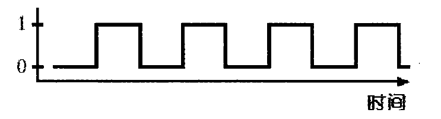

这一篇主要讲解内存和寄存器是如何存储数据。

在**逻辑电路**那篇文章中,讲述了如果使用逻辑门来搭建一个加\减法器,也就是说我们可以模拟CPU做加法运算了,但是这还远远不够,计算的结果我们该如何存储呢？ 我们总不能直接丢弃了吧。

这一篇我就带你来看看如和使用逻辑门来存储一位二进制数据bit,在此基础上在对底层进行抽象看看如何存储多位数据。

## 一、反馈电路

上述所举的例子都是在特定的输入产生特定的输出,那么有没有一种方式输入即是输出,输出也是输入呢？ 就像下面这样。

这个电路装置功能是将输入取反然后再将其输出作为输入,我们把这种电路称为振荡器,而这种电路连接的方式叫做反馈.振荡器本身的输出也是在0和1之间不断的变换,如下图所示:

振荡器从某个状态开始，经过一段时间后又回到初始状态,我们叫做一个循环或者一个周期. 而周期的倒数也就是我们所说的频率,用赫兹来表示。通过我们所说的CPU 2.5GHZ也就是指CPU内部晶体震荡的次数.

**如果我们将反馈的电路用于一对`或非门`看看有会发生什么情况呢？**

#### 或非门

或非门的特点是当输入全为0时输出为1,一个输入为1时输出为0.真值表如下:

| 输入 | 输出 | 结果 |
| ---- | ---- | ---- |
| 0    | 0    | 1    |
| 0    | 1    | 0    |
| 1    | 0    | 0    |
| 1    | 1    | 0    |

我们将两个或非门按照如下方式进行连接:

在初始电路状态下只有左边或非门的输出为1,右边的或非门输出0.  当`1号`输入为1时,左边的输出为0,而`2号`输入还是0,所以右边的或非门输出为1.此时由于电路反馈的原因，我们无论怎么改变`1号`的输入左边或非门的输出都不会发生改变,**永远为0**. 也就是说我们无论为`1号`输入做任何改变都无法改变最终门电路的输出。 这个不觉得很奇怪吗？

现在，我们将`2号`或非门的输入改变为1，此时右边的或非门电路输出永远为0,电路的最终输出也被改变了.  像是我们重置了某种状态让其回到最原始的形态。 而且，我们此时无论对`1号`输入做任何改变都无法改变整个门电路的输出结果。

到目前为止，我们可以总结以上电路的情况:

* `1号`输入为1时，门电路输出为1, 电路确定，不会因`1号`的输入改变而改变
* `2号`输入为1时，门电路输出为0, 电路确定，不会因`2号`的输入改变而改变

以上，对于拥有不同的输入却拥有这相同的输出电路组合我们称之为**触发器**. 触发器可以记住某种状态信息，比如，当我们知道上述的门电路输出为1时，我们也就是知道最后一次输入为1的是`1号`电路。

触发器的种类繁多，下面我们看看常用来存储的触发器。

## 二、触发器

#### R-S 触发器

基本RS触发器又称为SR锁存器，是触发器中最简单的一种，也是各种其他类型触发器的基本组成部分. 由两个**与非门**或者**或非门**的输入端输出端交叉耦合或者首尾相接组成，即可以构成一个基本的RS触发器。

S(Set)表示设置,为高电位;R(reset)表示重置,为低电位。 其输出也包含两个状态,Q和（Q反）。当Set置为1时，Q输出为1，当R置为1时，Q输出为0. 当R和S均为0时，输出Q和Q反保持上一个状态不变。

| S    | R    | Q    | Q反  |
| ---- | ---- | ---- | ---- |
| 1    | 0    | 1    | 0    |
| 0    | 1    | 0    | 1    |
| 0    | 0    | Q    | Q~   |
| 1    | 1    | 禁止 |      |

R-S触发器的连接如下:

#### D触发器

D触发器是在R-S触发器基础上构建出来的,它拥有一个数据端输入位、一个时钟端输入。当时钟端电信号由0转1时，输出的值和输入的值相等。

| D    | Ck   | Q    | Q~   |
| ---- | ---- | ---- | ---- |
| 0    | 1    | 0    | 1    |
| 1    | 1    | 1    | 0    |
| X    | 0    | Q    | Q~   |

由此，我们便使用D触发器锁住了一位bit位二进制数.为了便于理解，我们将`时钟`可以理解为允许写入线,将`数据端`理解为允许写入的数据。并将其封装在一个盒子中,拥有此盒子便可以向盒子读写1bit的数据和读取数据。